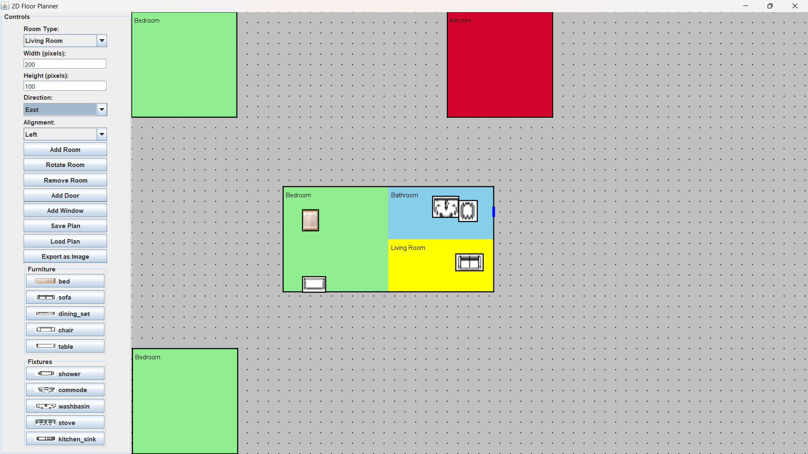

# 2D-Floor-Planner
A Java Swing-based desktop GUI application to design 2D house floor plans interactively.

## Features
- Add rooms with color-coded categories (e.g., Bedroom, Bathroom, Kitchen, etc.)
- Position rooms using relative alignment (North, South, East, West)
- Prevent overlapping of rooms, doors, windows, and fixtures
- Add doors and windows with alignment and placement constraints
- Place basic furniture/fixtures (e.g., bed, table, sofa, commode, etc.)
- Drag and reposition rooms with snap-back on invalid placement
- Save and reload plans via custom `.ser` file format
- Fullscreen canvas and control panel layout

## Technologies Used
- Java
- Java Swing (GUI)
- Custom serialization for save/load
- PNG assets for furniture/fixtures

## App Preview
> Here’s how the 2D Floor Planner looks while running:

## Contributors
> Umaang Khambhati,
> Aayush Shah,
> Anoushka Singh,
> Nayonika Shrivastava.
